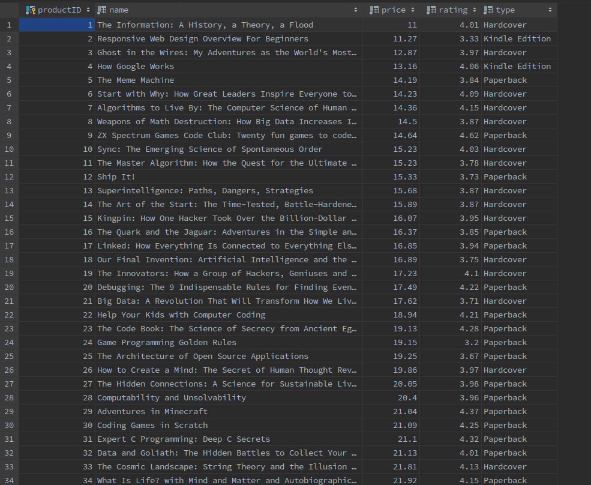

# Extract Transform Load procedure - HUA

##What is this all about
Please read [Extract-Transform-Load-Procedure-HUA](https://docs.google.com/document/d/1S0bsfSV8wyfmRdnTLYC2k5t9HR3GiPdVPvfVQ95Bi1E/edit)

## Installation
User the [docker-fedora-guide](https://docs.docker.com/engine/install/fedora/) to install docker in fedora. In case you have different linux distribution, please check the official guide
```bash
sudo dnf remove docker \
                  docker-client \
                  docker-client-latest \
                  docker-common \
                  docker-latest \
                  docker-latest-logrotate \
                  docker-logrotate \
                  docker-selinux \
                  docker-engine-selinux \
                  docker-engine
                  
sudo dnf -y install dnf-plugins-core

sudo dnf config-manager \
    --add-repo \
    https://download.docker.com/linux/fedora/docker-ce.repo
    
sudo dnf install docker-ce docker-ce-cli containerd.io
```

##Must steps
```bash
sudo dnf install mysql-workbench

pip install mysql-connector-python

pip install kafka-python

conda install -c conda-forge kafka-python

pip install Flask
```

##Optional steps
You might need to install Postman and any IDE you prefer.

##Neo4j
Install neo4j on docker using the name hua-neo4j and environment neo4j/hua-neo4j.
If the port 7687 is already in use, you should use the command "sudo lsof -i -P -n | grep"
and then kill it with "sudo kill (process_id)".
```bash
sudo docker run \
    --name hua-neo4j \
    -p7474:7474 -p7687:7687 \
    -d \
    -v $HOME/neo4j/data:/data \
    -v $HOME/neo4j/logs:/logs \
    -v $HOME/neo4j/import:/var/lib/neo4j/import \
    -v $HOME/neo4j/plugins:/plugins \
    --env NEO4J_AUTH=neo4j/hua-neo4j \
    neo4j:latest
```
## Docker Login
Use the command below in order to login in the docker using your credentials and run mysql service in the background
```bash
docker login 
username, password
sudo docker run --name hua-mysql -p 3307:3307 -e MYSQL_ROOT_PASSWORD=Qwerty123! -d mysql
```

##Database
First you need to create the schema 'hua-python' in order to run the script.

```bash
CREATE SCHEMA `hua-python` DEFAULT CHARACTER SET utf8mb4 COLLATE utf8mb4_0900_ai_ci;
```

##Kafka
If you want to manually create the topics, use the below command
```bash
sudo docker exec -it kafka /bin/sh
cd /opt/kafka/bin
./kafka-topics.sh --create --zookeeper zookeeper:2181 --replication-factor 1 --partitions 1 --topic products-topic
./kafka-topics.sh --create --zookeeper zookeeper:2181 --replication-factor 1 --partitions 1 --topic users-topic

To see the available lists
 ./bin/kafka-topics.sh --list --zookeeper zookeeper:2181

To copy the delete script in the tmp folder:
sudo docker cp deleteTopic.sh ee886fb4f646:/tmp
```

##How to run
```bash
sudo systemctl start docker
sudo docker-compose up -d
```

##Runtime
Downloaded and inserted the first 50 rows of this [dataset](https://www.kaggle.com/thomaskonstantin/top-270-rated-computer-science-programing-books) which contains Books products.
ID is manually inserted, the rest data is read from the csv reader.
productID, name, price, rating and type.



The script is responsible in its own execution to erase everything such as topics, users from Neo4j. MySQL's data are not erased.

