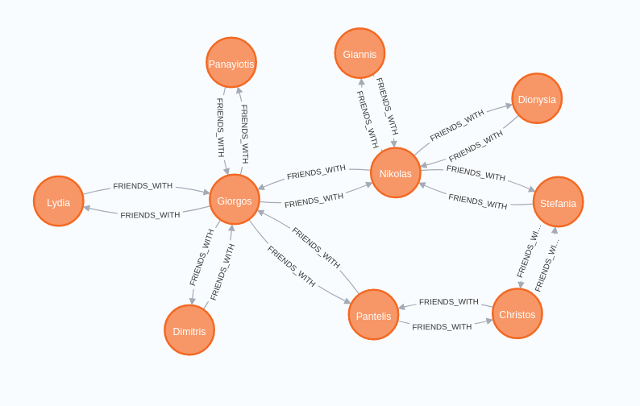

# Extract Transform Load procedure - HUA

## What this is all about
Please read [Extract-Transform-Load-Procedure-HUA](https://docs.google.com/document/d/1S0bsfSV8wyfmRdnTLYC2k5t9HR3GiPdVPvfVQ95Bi1E/edit)

## Installation
User the [docker-fedora-guide](https://docs.docker.com/engine/install/fedora/) to install docker in fedora. In case you have different linux distribution, please check the official guide.
```bash
sudo dnf remove docker \
                  docker-client \
                  docker-client-latest \
                  docker-common \
                  docker-latest \
                  docker-latest-logrotate \
                  docker-logrotate \
                  docker-selinux \
                  docker-engine-selinux \
                  docker-engine
                  
sudo dnf -y install dnf-plugins-core

sudo dnf config-manager \
    --add-repo \
    https://download.docker.com/linux/fedora/docker-ce.repo
    
sudo dnf install docker-ce docker-ce-cli containerd.io
```

## Necessary steps
```bash
sudo dnf install mysql-workbench

pip install mysql-connector-python

pip install kafka-python

conda install -c conda-forge kafka-python

pip install Flask
```

## Optional steps
Please install Postman (still you can use curl) and any IDE you prefer.
This project and every project of mine, is implemented using JetBrains Software.

## Neo4j installation
Install neo4j on docker using the name hua-neo4j and environment neo4j/hua-neo4j.
If the port 7687 is already in use, you should use the command "sudo lsof -i -P -n | grep"
and then kill it with "sudo kill (process_id)".
```bash
sudo docker run \
    --name hua-neo4j \
    -p7474:7474 -p7687:7687 \
    -d \
    -v $HOME/neo4j/data:/data \
    -v $HOME/neo4j/logs:/logs \
    -v $HOME/neo4j/import:/var/lib/neo4j/import \
    -v $HOME/neo4j/plugins:/plugins \
    --env NEO4J_AUTH=neo4j/hua-neo4j \
    neo4j:latest
```
## Docker Login
Use the command below in order to login in the docker using your credentials and run mysql service in the background.
```bash
docker login 
sudo docker run --name hua-mysql -p 3307:3307 -e MYSQL_ROOT_PASSWORD=Qwerty123! -d mysql
```

## Database
First you need to create the schema 'hua-python' in order to run the script.

```bash
CREATE SCHEMA `hua-python` DEFAULT CHARACTER SET utf8mb4 COLLATE utf8mb4_0900_ai_ci;
```

## Kafka
If you want to manually create the topics, use the below command
```bash
sudo docker exec -it kafka /bin/sh
cd /opt/kafka/bin
./kafka-topics.sh --create --zookeeper zookeeper:2181 --replication-factor 1 --partitions 1 --topic products-topic
./kafka-topics.sh --create --zookeeper zookeeper:2181 --replication-factor 1 --partitions 1 --topic users-topic

To see the available lists
 ./bin/kafka-topics.sh --list --zookeeper zookeeper:2181

To copy the delete script in the tmp folder:
sudo docker cp deleteTopic.sh [kafka-container-id]:/tmp
```

## How to run
```bash
sudo systemctl start docker
sudo docker-compose up -d
```

## Runtime
Downloaded and inserted the first 50 rows of this [dataset](https://www.kaggle.com/thomaskonstantin/top-270-rated-computer-science-programing-books) which contains Books products.
productID is manually inserted, the rest data is read from the csv reader.
name, price, rating and type.
Price transformed from string to float and rounded in 2 decimal.

The main script is responsible to erase everything in the very first step such as topics, users from Neo4j. MySQL's data are not erased.


In the next step, a graph of users is inserted in the Neo4j database with these attributes:
id, age, height, name and productID. <br />
The very first step is to delete every node. <br />
Products are inserted using random value from 1 up to 5 and the age is randomly selected from 18 up to 40. Same applied to height from 1.60 up to 1.90, rounded by 2 <br />
How friendship script is implemented: <br />
create_friendship_between_two(name1, name2) script creating the first users with every attribute. <br />
add_friendship_between_two(name1, name2) create a new friendship using the already created user and matches another one using find_person_by_name(name). <br />
The last script is match_friendship_between_two(name1, name2) where this function need to find two users by name using find_person_by_name(name). <br />



Two scripts for each producer exist. ERProducer.py sends messages to the products-topic and GraphProducer.py sends messages to the users-topic.


